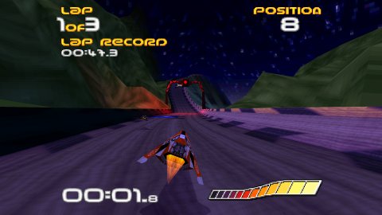
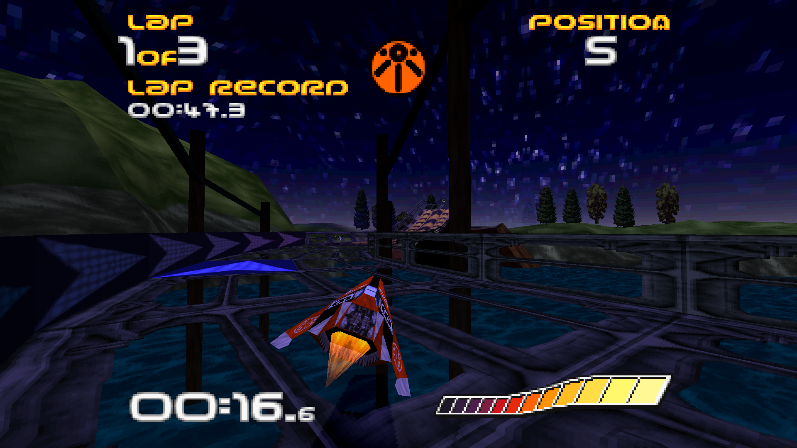
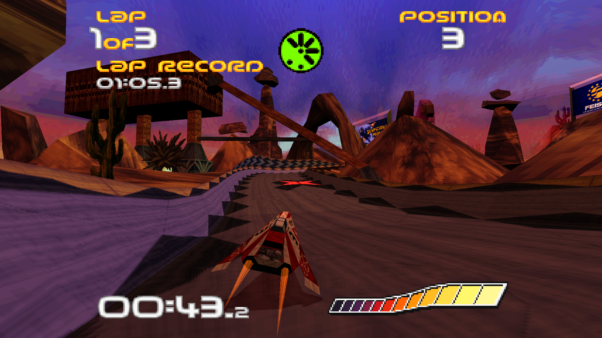
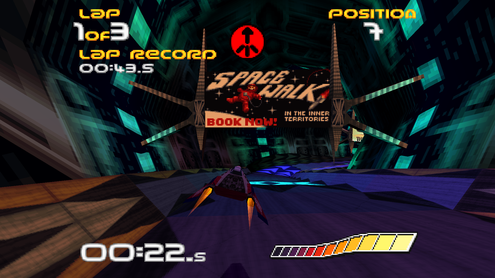
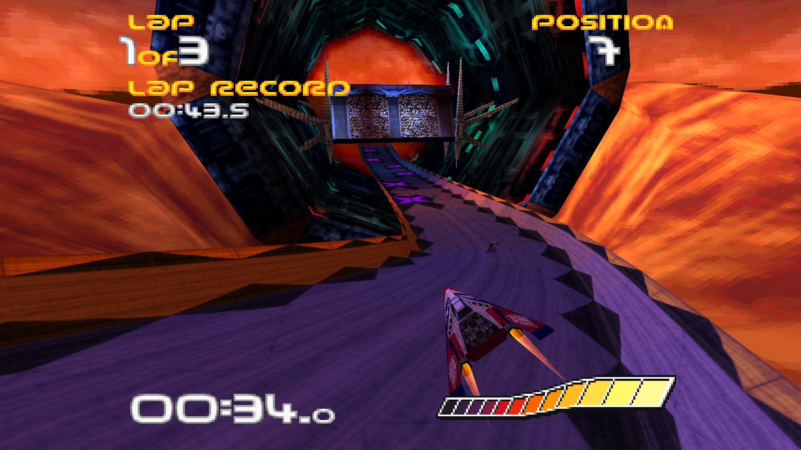
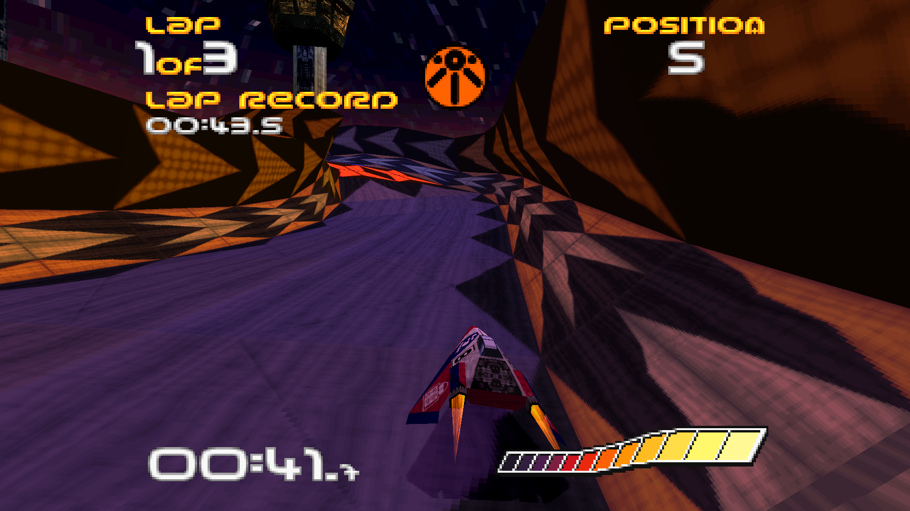

# WipeOut Phantom Edition
[](images/screenshot01.png)

WipeOut Phantom Edition is an enhanced PC source port of the original WipeOut. It uses game data from the PlayStation version and is much more comparable to the PlayStation version than the official PC port.

## Features
### Graphics
- Uncapped frame rate by decoupling rendering from from game state simulation.
- High resolution rendering.
- Widescreen support.
- Optional 320x240 graphics mode.
- Increased view distance.
- Distant geometry fade.
- Added particle effects for collisions and wall scraping.
- Ships inherit lighting from track lighting data, similar to WipeOut XL/2097 and WipeOut 3.
- Maintained authentic PlayStation look by only using blending features available on original hardware, while also providing high resolution smooth graphics.
### Gameplay
- Keyboard and gamepad input support.
- Wall collision response options:
  - Modern: Comparable to BallisticNG.
  - Classic: Comparable to WipeOut XL/2097.
  - Legacy: 🪦
- Fixed out of bounds detection on some large ramps.
- Improved Ship-vs-Ship collision response.
### Audio
- New music and sound effect system.
- 3D audio for sound effects.
### Technical
- Additional options menus to configure many of the new features.
- New config file system which stores game settings and progress in editable text files.
- The game can automatically extract game data files and music from provided PlayStation bin/cue disk image files.

## Setup
> #### **TL;DR**: Download the [latest release](https://github.com/wipeout-phantom-edition/wipeout-phantom-edition/releases/latest), put your PlayStation USA-region `.bin` and `.cue` files in `wipeout/diskimages`, and launch the game.

Download the [latest release](https://github.com/wipeout-phantom-edition/wipeout-phantom-edition/releases/latest) and unzip the `wipeout` folder to your desired location on your hard drive.

You'll need game data files from the original PlayStation USA-region version of Wipeout. You can either manually provide these files or supply bin/cue disk image files, which can be obtained by ripping a disk you own. The disk image method is preferred as it automatically extracts the music into wav files.

**IMPORTANT:** Ensure that the game data is from the **PlayStation USA-region** version of Wipeout. Data from official PC versions won't work.

### Disk Image Method
- **Place Disk Image Files**: Locate the `wipeout/diskimages` directory and place your Wipeout disk image files there.
- **Ensure Correct Format**: Your disk image must be a multi-bin `.bin` and `.cue` format. There should be 9 `.bin` files and one `.cue` file.
Example:
  ```
  WipeOut USA (Track 1).bin
  WipeOut USA (Track 2).bin
  WipeOut USA (Track 3).bin
  WipeOut USA (Track 4).bin
  WipeOut USA (Track 5).bin
  WipeOut USA (Track 6).bin
  WipeOut USA (Track 7).bin
  WipeOut USA (Track 8).bin
  WipeOut USA (Track 9).bin
  WipeOut USA.cue
  ```
The game data should be in "MODE2/2352" format in the first track of the cue sheet, while other tracks should be in "AUDIO" format.

**Extraction on Startup**: Upon launching, the game will check for missing data files and attempt to extract them from a disk image.

**Removal of Disk Image Files**: After the game has successfully loaded into the main menu once, the disk image files are no longer required and can be removed.

**NOTE: Since reading the file system in the disk image is non-trivial, a hash-based search is performed on the data track of the disk image. This can be slow on systems with less than 8 CPU cores.**

### Loose File Method
**Copying Game Files**: If you already possess all the game files (517 in total), copy them directly into the `wipeout/wipeoutgame` folder. These files can be obtained directly from a PlayStation disk using windows explorer.

**Music Files**: The downside of this method is that the music, which is stored in Red Book audio tracks on the CD and not in a file system, cannot be copied.

For music, you can use the Disk Image method, or if you have individual music files, place them in the `wipeout/music` folder. Note that these files must follow a specific naming convention, with 2-digit numbers between 01-32 in their name. For more information, see `wipeout/music/musicgoeshere.txt`.

## Screenshots
[](images/screenshot02.png)
[](images/screenshot03.png)
[](images/screenshot04.png)
[](images/screenshot05.png)
[](images/screenshot06.png)
